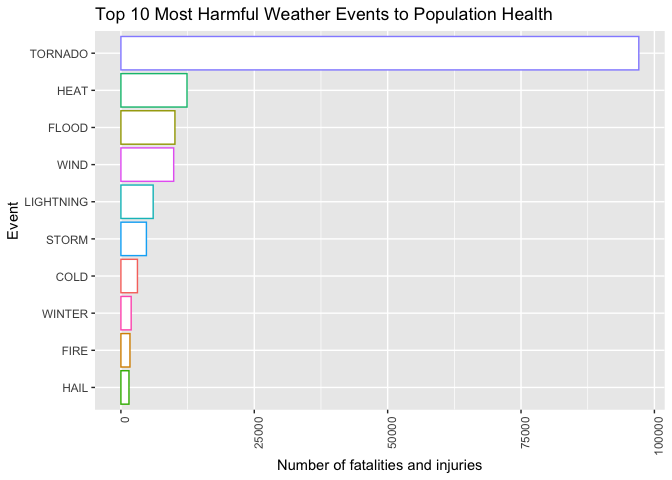
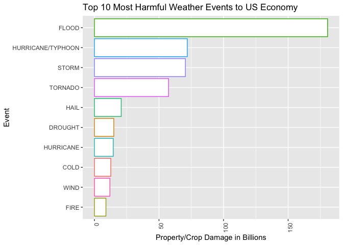

# Course Project 2

This course project is available on [GitHub](https://github.com/GhassaniS/Peer-Assessment-2).

## Synopsis
Storms and other severe weather events can cause both public health and economic problems for communities and municipalities. Many severe events can result in fatalities, injuries, and property damage, and preventing such outcomes to the extent possible is a key concern.

This project involves exploring the U.S. National Oceanic and Atmospheric Administration's (NOAA) storm database. This database tracks characteristics of major storms and weather events in the United States, including when and where they occur, as well as estimates of any fatalities, injuries, and property damage.


## Data Loading

### Loading Required Libraries 

```r
library(dplyr)
library(lubridate)
library(ggplot2)
```

### Loading Data
The source of the data file is from [here](https://d396qusza40orc.cloudfront.net/repdata%2Fdata%2FStormData.csv.bz2),
which covers weather events between 1950 and 2011. 

There is also some documentation of the database available:
<br>* [National Weather Service Storm Data Documentation](https://d396qusza40orc.cloudfront.net/repdata%2Fpeer2_doc%2Fpd01016005curr.pdf)
<br>* [National Climatic Data Center Storm Events FAQ](https://d396qusza40orc.cloudfront.net/repdata%2Fpeer2_doc%2FNCDC%20Storm%20Events-FAQ%20Page.pdf)


```r
StormDataURL <- "https://d396qusza40orc.cloudfront.net/repdata%2Fdata%2FStormData.csv.bz2"
StormDataFile <- "data/storm-data.csv.bz2"

if (!file.exists('data')) {
  dir.create('data')
}

if (!file.exists(StormDataFile)) {
  download.file(url = StormDataURL, destfile = StormDataFile)
}

#Load the Dataset
StormData <- read.csv(StormDataFile, sep = ",", header = TRUE)

#Show the Structure of the Dataset
str(StormData)
```

```
## 'data.frame':	902297 obs. of  37 variables:
##  $ STATE__   : num  1 1 1 1 1 1 1 1 1 1 ...
##  $ BGN_DATE  : chr  "4/18/1950 0:00:00" "4/18/1950 0:00:00" "2/20/1951 0:00:00" "6/8/1951 0:00:00" ...
##  $ BGN_TIME  : chr  "0130" "0145" "1600" "0900" ...
##  $ TIME_ZONE : chr  "CST" "CST" "CST" "CST" ...
##  $ COUNTY    : num  97 3 57 89 43 77 9 123 125 57 ...
##  $ COUNTYNAME: chr  "MOBILE" "BALDWIN" "FAYETTE" "MADISON" ...
##  $ STATE     : chr  "AL" "AL" "AL" "AL" ...
##  $ EVTYPE    : chr  "TORNADO" "TORNADO" "TORNADO" "TORNADO" ...
##  $ BGN_RANGE : num  0 0 0 0 0 0 0 0 0 0 ...
##  $ BGN_AZI   : chr  "" "" "" "" ...
##  $ BGN_LOCATI: chr  "" "" "" "" ...
##  $ END_DATE  : chr  "" "" "" "" ...
##  $ END_TIME  : chr  "" "" "" "" ...
##  $ COUNTY_END: num  0 0 0 0 0 0 0 0 0 0 ...
##  $ COUNTYENDN: logi  NA NA NA NA NA NA ...
##  $ END_RANGE : num  0 0 0 0 0 0 0 0 0 0 ...
##  $ END_AZI   : chr  "" "" "" "" ...
##  $ END_LOCATI: chr  "" "" "" "" ...
##  $ LENGTH    : num  14 2 0.1 0 0 1.5 1.5 0 3.3 2.3 ...
##  $ WIDTH     : num  100 150 123 100 150 177 33 33 100 100 ...
##  $ F         : int  3 2 2 2 2 2 2 1 3 3 ...
##  $ MAG       : num  0 0 0 0 0 0 0 0 0 0 ...
##  $ FATALITIES: num  0 0 0 0 0 0 0 0 1 0 ...
##  $ INJURIES  : num  15 0 2 2 2 6 1 0 14 0 ...
##  $ PROPDMG   : num  25 2.5 25 2.5 2.5 2.5 2.5 2.5 25 25 ...
##  $ PROPDMGEXP: chr  "K" "K" "K" "K" ...
##  $ CROPDMG   : num  0 0 0 0 0 0 0 0 0 0 ...
##  $ CROPDMGEXP: chr  "" "" "" "" ...
##  $ WFO       : chr  "" "" "" "" ...
##  $ STATEOFFIC: chr  "" "" "" "" ...
##  $ ZONENAMES : chr  "" "" "" "" ...
##  $ LATITUDE  : num  3040 3042 3340 3458 3412 ...
##  $ LONGITUDE : num  8812 8755 8742 8626 8642 ...
##  $ LATITUDE_E: num  3051 0 0 0 0 ...
##  $ LONGITUDE_: num  8806 0 0 0 0 ...
##  $ REMARKS   : chr  "" "" "" "" ...
##  $ REFNUM    : num  1 2 3 4 5 6 7 8 9 10 ...
```

```r
#Check the First 6 rows
head(StormData)
```

```
##   STATE__           BGN_DATE BGN_TIME TIME_ZONE COUNTY COUNTYNAME STATE  EVTYPE
## 1       1  4/18/1950 0:00:00     0130       CST     97     MOBILE    AL TORNADO
## 2       1  4/18/1950 0:00:00     0145       CST      3    BALDWIN    AL TORNADO
## 3       1  2/20/1951 0:00:00     1600       CST     57    FAYETTE    AL TORNADO
## 4       1   6/8/1951 0:00:00     0900       CST     89    MADISON    AL TORNADO
## 5       1 11/15/1951 0:00:00     1500       CST     43    CULLMAN    AL TORNADO
## 6       1 11/15/1951 0:00:00     2000       CST     77 LAUDERDALE    AL TORNADO
##   BGN_RANGE BGN_AZI BGN_LOCATI END_DATE END_TIME COUNTY_END COUNTYENDN
## 1         0                                               0         NA
## 2         0                                               0         NA
## 3         0                                               0         NA
## 4         0                                               0         NA
## 5         0                                               0         NA
## 6         0                                               0         NA
##   END_RANGE END_AZI END_LOCATI LENGTH WIDTH F MAG FATALITIES INJURIES PROPDMG
## 1         0                      14.0   100 3   0          0       15    25.0
## 2         0                       2.0   150 2   0          0        0     2.5
## 3         0                       0.1   123 2   0          0        2    25.0
## 4         0                       0.0   100 2   0          0        2     2.5
## 5         0                       0.0   150 2   0          0        2     2.5
## 6         0                       1.5   177 2   0          0        6     2.5
##   PROPDMGEXP CROPDMG CROPDMGEXP WFO STATEOFFIC ZONENAMES LATITUDE LONGITUDE
## 1          K       0                                         3040      8812
## 2          K       0                                         3042      8755
## 3          K       0                                         3340      8742
## 4          K       0                                         3458      8626
## 5          K       0                                         3412      8642
## 6          K       0                                         3450      8748
##   LATITUDE_E LONGITUDE_ REMARKS REFNUM
## 1       3051       8806              1
## 2          0          0              2
## 3          0          0              3
## 4          0          0              4
## 5          0          0              5
## 6          0          0              6
```

## Data Processing

There are 902,297 observations with 37 variables in the dataset. Only a subset is required for the analysis. 

Variable Name       | Description
--------------------|----------------
EVTYPE              | Event type (Flood, heat, hurricane, tornado, etc.)
FATALITIES          | Number of fatalities resulting from event
INJURIES            | Number of persons injured due to event
PROPDMG             | Property damage in USD
PROPDMGEXP          | Unit multiplier for property damage (K, M, or B)
CROPDMG             | Crop damage in USD
CROPDMGEXP          | Unit multiplier for crop damage (K, M, or B)
BGN_DATE            | Beginning date
END_DATE            | End date
STATE               | State where the event occurred


```r
StormDataTidy <- subset(StormData, EVTYPE !="?"
                        & (FATALITIES > 0 | INJURIES > 0 | PROPDMG > 0 | CROPDMG >0),
                        select = c("EVTYPE",
                                   "FATALITIES",
                                   "INJURIES",
                                   "PROPDMG",
                                   "PROPDMGEXP",
                                   "CROPDMG",
                                   "CROPDMGEXP",
                                   "BGN_DATE",
                                   "END_DATE",
                                   "STATE"))

dim(StormDataTidy)
```

```
## [1] 254632     10
```

```r
sum(is.na(StormDataTidy))
```

```
## [1] 0
```
The cleaned up dataset now contains 254,632 observations, 10 variables, and no missing values. 

### Tidy Up Event Type 


```r
length(unique(StormDataTidy$EVTYPE))
```

```
## [1] 487
```
Currently, there are 487 unique Event Type values. This is possibly due to the different types of spelling used to describe the same Event Type. For example, Strong Wind and STRONG WIND. These Event Type values will all be converted to uppercase. 


```r
StormDataTidy$EVTYPE <- toupper(StormDataTidy$EVTYPE)
```


```r
# AVALANCHE
StormDataTidy$EVTYPE <- gsub('.*AVALANCE.*', 'AVALANCHE', StormDataTidy$EVTYPE)

# BLIZZARD
StormDataTidy$EVTYPE <- gsub('.*BLIZZARD.*', 'BLIZZARD', StormDataTidy$EVTYPE)

# CLOUD
StormDataTidy$EVTYPE <- gsub('.*CLOUD.*', 'CLOUD', StormDataTidy$EVTYPE)

# COLD
StormDataTidy$EVTYPE <- gsub('.*COLD.*', 'COLD', StormDataTidy$EVTYPE)
StormDataTidy$EVTYPE <- gsub('.*FREEZ.*', 'COLD', StormDataTidy$EVTYPE)
StormDataTidy$EVTYPE <- gsub('.*FROST.*', 'COLD', StormDataTidy$EVTYPE)
StormDataTidy$EVTYPE <- gsub('.*ICE.*', 'COLD', StormDataTidy$EVTYPE)
StormDataTidy$EVTYPE <- gsub('.*LOW TEMPERATURE RECORD.*', 'COLD', StormDataTidy$EVTYPE)
StormDataTidy$EVTYPE <- gsub('.*LO.*TEMP.*', 'COLD', StormDataTidy$EVTYPE)

# DRY
StormDataTidy$EVTYPE <- gsub('.*DRY.*', 'DRY', StormDataTidy$EVTYPE)

# DUST
StormDataTidy$EVTYPE <- gsub('.*DUST.*', 'DUST', StormDataTidy$EVTYPE)

# FIRE
StormDataTidy$EVTYPE <- gsub('.*FIRE.*', 'FIRE', StormDataTidy$EVTYPE)

# FLOOD
StormDataTidy$EVTYPE <- gsub('.*FLOOD.*', 'FLOOD', StormDataTidy$EVTYPE)

# FOG
StormDataTidy$EVTYPE <- gsub('.*FOG.*', 'FOG', StormDataTidy$EVTYPE)

# HAIL
StormDataTidy$EVTYPE <- gsub('.*HAIL.*', 'HAIL', StormDataTidy$EVTYPE)

# HEAT
StormDataTidy$EVTYPE <- gsub('.*HEAT.*', 'HEAT', StormDataTidy$EVTYPE)
StormDataTidy$EVTYPE <- gsub('.*WARM.*', 'HEAT', StormDataTidy$EVTYPE)
StormDataTidy$EVTYPE <- gsub('.*HIGH.*TEMP.*', 'HEAT', StormDataTidy$EVTYPE)
StormDataTidy$EVTYPE <- gsub('.*RECORD HIGH TEMPERATURES.*', 'HEAT', StormDataTidy$EVTYPE)

# HYPOTHERMIA/EXPOSURE
StormDataTidy$EVTYPE <- gsub('.*HYPOTHERMIA.*', 'HYPOTHERMIA/EXPOSURE', StormDataTidy$EVTYPE)

# LANDSLIDE
StormDataTidy$EVTYPE <- gsub('.*LANDSLIDE.*', 'LANDSLIDE', StormDataTidy$EVTYPE)

# LIGHTNING
StormDataTidy$EVTYPE <- gsub('^LIGHTNING.*', 'LIGHTNING', StormDataTidy$EVTYPE)
StormDataTidy$EVTYPE <- gsub('^LIGNTNING.*', 'LIGHTNING', StormDataTidy$EVTYPE)
StormDataTidy$EVTYPE <- gsub('^LIGHTING.*', 'LIGHTNING', StormDataTidy$EVTYPE)

# MICROBURST
StormDataTidy$EVTYPE <- gsub('.*MICROBURST.*', 'MICROBURST', StormDataTidy$EVTYPE)

# MUDSLIDE
StormDataTidy$EVTYPE <- gsub('.*MUDSLIDE.*', 'MUDSLIDE', StormDataTidy$EVTYPE)
StormDataTidy$EVTYPE <- gsub('.*MUD SLIDE.*', 'MUDSLIDE', StormDataTidy$EVTYPE)

# RAIN
StormDataTidy$EVTYPE <- gsub('.*RAIN.*', 'RAIN', StormDataTidy$EVTYPE)

# RIP CURRENT
StormDataTidy$EVTYPE <- gsub('.*RIP CURRENT.*', 'RIP CURRENT', StormDataTidy$EVTYPE)

# STORM
StormDataTidy$EVTYPE <- gsub('.*STORM.*', 'STORM', StormDataTidy$EVTYPE)

# SUMMARY
StormDataTidy$EVTYPE <- gsub('.*SUMMARY.*', 'SUMMARY', StormDataTidy$EVTYPE)

# TORNADO
StormDataTidy$EVTYPE <- gsub('.*TORNADO.*', 'TORNADO', StormDataTidy$EVTYPE)
StormDataTidy$EVTYPE <- gsub('.*TORNDAO.*', 'TORNADO', StormDataTidy$EVTYPE)
StormDataTidy$EVTYPE <- gsub('.*LANDSPOUT.*', 'TORNADO', StormDataTidy$EVTYPE)
StormDataTidy$EVTYPE <- gsub('.*WATERSPOUT.*', 'TORNADO', StormDataTidy$EVTYPE)

# SURF
StormDataTidy$EVTYPE <- gsub('.*SURF.*', 'SURF', StormDataTidy$EVTYPE)

# VOLCANIC
StormDataTidy$EVTYPE <- gsub('.*VOLCANIC.*', 'VOLCANIC', StormDataTidy$EVTYPE)

# WET
StormDataTidy$EVTYPE <- gsub('.*WET.*', 'WET', StormDataTidy$EVTYPE)

# WIND
StormDataTidy$EVTYPE <- gsub('.*WIND.*', 'WIND', StormDataTidy$EVTYPE)

# WINTER
StormDataTidy$EVTYPE <- gsub('.*WINTER.*', 'WINTER', StormDataTidy$EVTYPE)
StormDataTidy$EVTYPE <- gsub('.*WINTRY.*', 'WINTER', StormDataTidy$EVTYPE)
StormDataTidy$EVTYPE <- gsub('.*SNOW.*', 'WINTER', StormDataTidy$EVTYPE)
```

Let's check how many unique Event Type values we have now.

```r
length(unique(StormDataTidy$EVTYPE))
```

```
## [1] 81
```

We now have only 81 unique Event Type values. 

### Tidy Up Date

The raw dataset used factors to store BGN_DATE and END_DATE variables. We will transform this into date types that can be manipulated and reported on by creating new variables based on date variables in the tidy dataset.


Variable Name       | Description
--------------------|----------------
DATE_START          | Date that the event began
DATE_END            | Date that the event ended
YEAR                | Year the event started
DURATION             | Duration of the event in hours 


```r
StormDataTidy$DATE_START <- as.Date(StormDataTidy$BGN_DATE, format = "%m/%d/%Y")
StormDataTidy$DATE_END <- as.Date(StormDataTidy$END_DATE, format = "%m/%d/%Y")
StormDataTidy$YEAR <- as.integer(format(StormDataTidy$DATE_START, "%Y"))
StormDataTidy$DURATION <- as.numeric(StormDataTidy$DATE_END - StormDataTidy$DATE_START)/3600
```

### Tidy Up Economic Data


```r
table(toupper(StormDataTidy$PROPDMGEXP))
```

```
## 
##             -      +      0      2      3      4      5      6      7      B 
##  11585      1      5    210      1      1      4     18      3      3     40 
##      H      K      M 
##      7 231427  11327
```


```r
table(toupper(StormDataTidy$CROPDMGEXP))
```

```
## 
##             ?      0      B      K      M 
## 152663      6     17      7  99953   1986
```

To calculate costs, PROPDMGEXP and CROPDMGEXP will be mapped to a multiplier factor. We will create two new variables to store damage costs.


```r
#Function to get Multiplier Factor

getMultiplier <- function(exp) {
  exp <- toupper(exp);
  if (exp == "")  return (10^0);
    if (exp == "-") return (10^0);
    if (exp == "?") return (10^0);
    if (exp == "+") return (10^0);
    if (exp == "0") return (10^0);
    if (exp == "1") return (10^1);
    if (exp == "2") return (10^2);
    if (exp == "3") return (10^3);
    if (exp == "4") return (10^4);
    if (exp == "5") return (10^5);
    if (exp == "6") return (10^6);
    if (exp == "7") return (10^7);
    if (exp == "8") return (10^8);
    if (exp == "9") return (10^9);
    if (exp == "H") return (10^2);
    if (exp == "K") return (10^3);
    if (exp == "M") return (10^6);
    if (exp == "B") return (10^9);
    return (NA);
}

# Calculate property damage and crop damage costs in billions
StormDataTidy$PROP_COST <- with(StormDataTidy, as.numeric(PROPDMG) * sapply(PROPDMGEXP, getMultiplier))/10^9
StormDataTidy$CROP_COST <- with(StormDataTidy, as.numeric(CROPDMG) * sapply(CROPDMGEXP, getMultiplier))/10^9
```

## Summarise Data

Create a summarised dataset of health impact data (fatalities and injuries) and sort the results in descending order by health impact. 


```r
HealthImpact <- aggregate(x = list(HEALTH_IMPACT = StormDataTidy$FATALITIES + StormDataTidy$INJURIES),
                          by = list(EVENT_TYPE = StormDataTidy$EVTYPE),
                          FUN = sum,
                          na.rm = TRUE)
HealthImpact <- HealthImpact[order(HealthImpact$HEALTH_IMPACT, decreasing = TRUE),]
```

Create a summarised dataset of damage impact costs and sort the results in descending order. 


```r
DamageCost <- aggregate(x = list(DMG_IMPACT = StormDataTidy$PROP_COST + StormDataTidy$CROP_COST),
                          by = list(EVENT_TYPE = StormDataTidy$EVTYPE),
                          FUN = sum,
                          na.rm = TRUE)
DamageCost <- DamageCost[order(DamageCost$DMG_IMPACT, decreasing = TRUE),]
```

## Results
### Event Types Most Harmful to Health

The results below show the top 10 most harmful weather events to population health. 


```r
Graph1 <- ggplot(HealthImpact[1:10,], aes(x=reorder(EVENT_TYPE, HEALTH_IMPACT),y=HEALTH_IMPACT,color=EVENT_TYPE)) + 
      coord_flip() +
      geom_bar(stat="identity", fill="white") + 
      theme(axis.text.x = element_text(angle = 90, hjust = 1)) + 
      xlab("Event") + ylab("Number of fatalities and injuries") +
      theme(legend.position="none") +
      ggtitle("Top 10 Most Harmful Weather Events to Population Health")

Graph1
```

<!-- -->

### Event Types with Most Economic Consequences

The results below show the top 10 most harmful weather events to the US economy. 


```r
Graph2 <- ggplot(DamageCost[1:10,], aes(x=reorder(EVENT_TYPE, DMG_IMPACT),y=DMG_IMPACT,color=EVENT_TYPE)) + 
      coord_flip() +
      geom_bar(stat="identity", fill="white") + 
      theme(axis.text.x = element_text(angle = 90, hjust = 1)) + 
      xlab("Event") + ylab("Property/Crop Damage in Billions") +
      theme(legend.position="none") +
      ggtitle("Top 10 Most Harmful Weather Events to US Economy")

Graph2
```

<!-- -->


## Conclusion 
Based on the data and evidence demonstrated in this analysis, we can answer two questions:

* **Which types of weather events are most harmful to population health?**
Tornadoes cause the most number of fatalities and injuries.

* **Which types of weather events are most harmful to US economy?**
Floods cause the most economic consequences to US economy.
